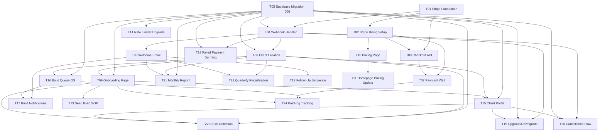

# PRD — eevolvv Autonomous Side-Gig Pivot

**Slug:** `autonomous-sidegig-pivot`
**Version:** 1.0
**Created:** 2026-05-06
**Status:** Approved — Ready for Execution
**Owner:** E (Eduardo Barbosa)

---

## Executive Summary

eevolvv is converting its AI diagnostic engine into a fully autonomous managed service business. The pivot transforms what is currently a free diagnostic conversation (ChatEngine.tsx) into a revenue-generating pipeline: a paying client completes a diagnostic, hits a payment wall, selects a subscription tier, pays via Stripe, receives an automated onboarding sequence, enters a build queue, gets a complete digital build delivered, and is maintained indefinitely — with monthly reports, churn detection, and quarterly re-calibrations running without human initiation.

The competitive gap is real and defensible. Every autonomous site builder on the market (Durable, 10Web, Framer, Mixo) stops at the website layer. None combine a free AI diagnostic with autonomous operational builds and ongoing subscription maintenance. The eevolvv service is priced at 90% below traditional automation consultancies ($2K–$25K/month) while delivering comparable scope for the Evolve tier and superior automation for Seed and Core. The business is viable as a side-gig with two humans in oversight roles — the technician handles build QA and go/no-go approval; E handles escalations. Everything else runs on code.

This build covers the complete automation pipeline from payment capture through subscription lifecycle management. The original 14 tasks handle the revenue foundation (Stripe, database, onboarding, payment wall, email sequences). The expanded 10 tasks (T15–T24) add the client portal, internal build queue OS view, build lifecycle notification emails, failed payment dunning, upgrade/downgrade/cancellation flows, monthly automated reports, churn risk detection, quarterly re-calibration triggers, and full PostHog funnel instrumentation. Together, 24 tasks across 5 waves deliver a system where neither human needs to intervene between payment and a live build being delivered and maintained.

---

## Research Findings

*Source: `.karimo/prds/autonomous-sidegig-pivot/research/summary.md` (2026-05-06)*

**Market position:** The autonomous site builder market has a confirmed gap — no competitor combines free diagnostic + autonomous build + subscription maintenance. Hocoos shutting down April 2026 confirms the commodity website tier is dead. eevolvv's true competitive set is AI automation agencies charging $2K–$25K/month.

**Codebase state:** The diagnostic → report flow is production-quality. The OS multi-client agent runtime exists. Langfuse tracing and Vercel cron are running. Gaps are entirely on the revenue side: Stripe is not wired, no payment wall exists, no automated onboarding has been built.

**Automation ceiling at launch:**
- Seed: ~85% automatable (technician does QA approval only)
- Core: ~65% automatable (technician actively participates in build)
- Evolve: ~45% automatable (technician is primary engineer)

**Top 3 risks:**
1. Seed unit economics collapse at >6% monthly churn — annual plans as default offer required
2. Automation ceiling for Core/Evolve — technician is doing real work for first 12 months
3. Post-report ghosting — without an active payment wall and follow-up sequence, conversion rate defaults to near 0%

**Pricing structure confirmed:**
- Seed: $99/mo | $950/yr — Landing page + 1 automation workflow, 72hr build SLA
- Core: $499/mo | $4,790/yr — Web app + 3–5 AI agents + integrations, 7–10 day build SLA
- Evolve: $1,999/mo | $19,190/yr — Full-stack build + CRM/ERP + dashboards, 14–21 day build SLA

---

## Goals & Success Criteria

| Goal | Success Metric | Target |
|------|---------------|--------|
| Revenue capture activated | First paid Stripe subscription | Week 1 post-deploy |
| Payment → onboarding automated | Time from payment to onboarding email received | < 2 minutes |
| Build queue visible | Technician can see and claim builds in OS | Week 1 post-deploy |
| Client informed throughout | Build lifecycle emails sent at each status change | 100% of status transitions |
| Failed payments recovered | Dunning email sent within 1 hour of `invoice.payment_failed` | 100% of failures |
| Subscription self-service | Client can upgrade, downgrade, or cancel from portal without contacting E | Week 2 post-deploy |
| Automated reporting | Monthly report emailed to each active client with zero manual action | 1st of each month |
| Churn signals detected | At-risk clients flagged in DB and E notified before churn event | Weekly cron |
| Funnel instrumented | PostHog tracks every conversion step from diagnostic_started to build_live | 100% coverage |
| MRR milestone | $3,600 MRR (15 clients, blended mix) | Month 3 post-launch |

---

## Out of Scope

The following are explicitly excluded from this build:

- **Micro tier ($29–$49/mo):** Reserved for the global WhatsApp-first expansion. Adding a fourth tier at launch diffuses focus and creates support complexity.
- **Evolve custom build automation:** Evolve remains discovery-first with technician as primary engineer. No automated build pipeline for Evolve in this PRD.
- **WhatsApp integration:** Long-term planned. Not in this build.
- **n8n orchestration:** Add at 10+ clients. Not required at launch.
- **Playwright QA pipeline:** Listed in research Phase 2. Not included in this PRD — technician handles QA manually.
- **Seed build automation (Claude Code + v0.dev pipeline):** The build SOP (T13) documents the semi-manual process. Full Seed automation is a Phase 2 initiative.
- **Evolve quarterly re-calibration full automation:** T23 sends the trigger email and links to Calendly/diagnostic re-run; full workflow automation is Phase 3.
- **Investor pitch updates:** Separate project. Out of scope here.

---

## Technical Context

### What Exists

| Component | File/Location | State |
|-----------|--------------|-------|
| AI diagnostic chat | `components/ChatEngine.tsx` | Production-quality — ~line 499 has Calendly CTA to replace |
| Diagnostic API | `app/api/diagnostic/route.ts` | Live |
| Email infrastructure | `emails/EvolutionReport.tsx` + Resend | Live |
| Rate limiter | `lib/rateLimit.ts` | Live — IP-based, 3/hr |
| Supabase client | `lib/supabase.ts` | Live — `submissions` table |
| OS (internal tools) | `app/os/` | Exists — multi-client agent runtime |
| Vercel cron | Configured | Running |
| PostHog | Configured | Running — not yet instrumenting funnel |
| Langfuse | Configured | Running |

### What Must Be Built

| Gap | Tasks |
|-----|-------|
| Stripe not installed | T01, T02 |
| No payment wall | T03, T07 |
| No webhook handler | T04 |
| No subscription/build DB tables | T05 |
| No client record creation | T06 |
| No welcome/onboarding emails | T08 |
| No onboarding page | T09 |
| No pricing page | T10 |
| No client portal | T15 |
| No build queue OS view | T16 |
| No build lifecycle emails | T17 |
| No dunning/churn webhook handling | T18 |
| No upgrade/downgrade/cancel flows | T19, T20 |
| No automated monthly reports | T21 |
| No churn detection | T22 |
| No re-calibration trigger | T23 |
| No funnel instrumentation | T24 |

### Environment Variables Required

```
STRIPE_SECRET_KEY
STRIPE_WEBHOOK_SECRET
NEXT_PUBLIC_STRIPE_PUBLISHABLE_KEY
STRIPE_PRICE_ID_SEED_MONTHLY
STRIPE_PRICE_ID_SEED_ANNUAL
STRIPE_PRICE_ID_CORE_MONTHLY
STRIPE_PRICE_ID_CORE_ANNUAL
STRIPE_PRICE_ID_EVOLVE_MONTHLY
STRIPE_PRICE_ID_EVOLVE_ANNUAL
```

---

## Tasks

### T01 — Stripe Foundation

**Priority:** must | **Complexity:** 2 | **Model:** sonnet | **Wave:** 1

Install the `stripe` npm package, create `lib/stripe.ts` as a singleton Stripe client, and document all required environment variables in `.env.example`.

**Acceptance Criteria:**
- `stripe` package installed and importable
- `lib/stripe.ts` exports an initialized Stripe client using `STRIPE_SECRET_KEY`
- `.env.example` updated with `STRIPE_SECRET_KEY`, `STRIPE_WEBHOOK_SECRET`, `NEXT_PUBLIC_STRIPE_PUBLISHABLE_KEY` and all 6 price ID vars

**Files Affected:**
- `lib/stripe.ts` (create)
- `package.json`
- `.env.example`

**Depends on:** none

---

### T02 — Stripe Billing Setup

**Priority:** must | **Complexity:** 2 | **Model:** sonnet | **Wave:** 1

Create 6 Stripe Products and Prices in the Stripe dashboard (or via script): Seed Monthly, Seed Annual, Core Monthly, Core Annual, Evolve Monthly, Evolve Annual. Document all price IDs in a constants file and `.env.example`.

**Acceptance Criteria:**
- 6 products exist in Stripe dashboard with correct names and prices
- `lib/stripe-prices.ts` exports typed constants mapping tier + interval to price ID
- All price IDs are env-var driven so staging/prod can differ
- Annual prices reflect "2 months free" discount vs monthly rate

**Prices:**
- Seed Monthly: $99 | Seed Annual: $950
- Core Monthly: $499 | Core Annual: $4,790
- Evolve Monthly: $1,999 | Evolve Annual: $19,190

**Files Affected:**
- `lib/stripe-prices.ts` (create)
- `.env.example`

**Depends on:** T01

---

### T03 — Checkout API Route

**Priority:** must | **Complexity:** 3 | **Model:** sonnet | **Wave:** 2

Build `app/api/stripe/checkout/route.ts` — a POST endpoint that accepts `{ priceId, email }`, creates a Stripe Checkout Session with `mode: "subscription"`, and returns the session URL for client-side redirect.

**Acceptance Criteria:**
- POST `/api/stripe/checkout` accepts `{ priceId, email }` body
- Creates Stripe Checkout Session with correct `success_url` and `cancel_url`
- `success_url` includes `{CHECKOUT_SESSION_ID}` for post-payment verification
- Returns `{ url }` for frontend redirect
- Handles Stripe errors with appropriate HTTP status codes
- `customer_email` pre-filled from request body

**Files Affected:**
- `app/api/stripe/checkout/route.ts` (create)

**Depends on:** T01, T02

---

### T04 — Webhook Handler

**Priority:** must | **Complexity:** 4 | **Model:** sonnet | **Wave:** 2

Build `app/api/stripe/webhook/route.ts` — verifies Stripe webhook signature, routes events to handlers. Initial events: `checkout.session.completed`, `invoice.payment_succeeded`, `invoice.payment_failed`, `customer.subscription.updated`, `customer.subscription.deleted`.

**Acceptance Criteria:**
- Stripe webhook signature verification using `STRIPE_WEBHOOK_SECRET`
- Raw body parsing (not JSON — Stripe requires raw body for signature)
- Event router dispatches to typed handler functions
- `checkout.session.completed` handler calls `createClientRecord()` (implemented in T06)
- `invoice.payment_succeeded` handler updates `subscriptions.status = 'active'`
- Unhandled events return 200 (Stripe requirement)
- Failed handler does NOT throw — logs error and returns 200

**Files Affected:**
- `app/api/stripe/webhook/route.ts` (create)
- `lib/webhook-handlers.ts` (create)

**Depends on:** T01, T05

---

### T05 — Supabase Migration 006

**Priority:** must | **Complexity:** 4 | **Model:** sonnet | **Wave:** 1

Create `supabase/migrations/006_subscriptions_builds.sql` defining 4 tables: `clients`, `subscriptions`, `builds`, `onboarding_tokens`. Include RLS policies for each table.

**Acceptance Criteria:**
- `clients` table: `id`, `email`, `name`, `tier`, `stripe_customer_id`, `churn_risk` (boolean), `created_at`
- `subscriptions` table: `id`, `client_id` (FK), `stripe_subscription_id`, `stripe_price_id`, `status`, `current_period_end`, `cancel_at_period_end`, `created_at`
- `builds` table: `id`, `client_id` (FK), `tier`, `status` (queued|in_progress|qa|deploying|live), `assigned_to`, `build_url`, `notes`, `started_at`, `completed_at`, `created_at`
- `onboarding_tokens` table: `id`, `client_id` (FK), `token` (uuid), `completed_at`, `expires_at`, `created_at`
- RLS: service role has full access; anon has no access; clients can read their own records via token (policy defined for onboarding_tokens)
- Migration runs without error on existing Supabase project

**Files Affected:**
- `supabase/migrations/006_subscriptions_builds.sql` (create)

**Depends on:** none

---

### T06 — Webhook → Client Creation + Onboarding Trigger

**Priority:** must | **Complexity:** 5 | **Model:** opus | **Wave:** 3

Implement `createClientRecord()` in `lib/webhook-handlers.ts`. On `checkout.session.completed`: create a record in `clients`, create a record in `subscriptions`, generate a UUID onboarding token in `onboarding_tokens`, and trigger the welcome + onboarding emails (T08). This is the automation bridge between payment and service delivery.

**Acceptance Criteria:**
- Idempotent — if called twice for the same session ID, second call is a no-op (check `stripe_subscription_id` uniqueness)
- Creates `clients` record with email, tier derived from price ID, Stripe customer ID
- Creates `subscriptions` record with correct status and billing interval
- Generates cryptographically random UUID token, inserts into `onboarding_tokens` with 30-day expiry
- Calls `sendWelcomeEmail()` with token (T08)
- Calls `sendOnboardingEmail()` with token (T08)
- Entire operation wrapped in a try/catch — failure is logged, not thrown (webhook must return 200)

**Files Affected:**
- `lib/webhook-handlers.ts`
- `lib/supabase.ts` (add helper functions)

**Depends on:** T04, T05

---

### T07 — Payment Wall in ChatEngine.tsx

**Priority:** must | **Complexity:** 4 | **Model:** sonnet | **Wave:** 2

Replace the Calendly CTA at ~line 499 of `components/ChatEngine.tsx` with inline tier selection cards (Seed / Core / Evolve) that route to Stripe Checkout via the `/api/stripe/checkout` endpoint.

**Acceptance Criteria:**
- Payment wall appears at the correct conversation stage (after report is delivered)
- Three tier cards displayed inline: Seed ($99/mo or $950/yr), Core ($499/mo or $4,790/yr), Evolve ($1,999/mo or $19,190/yr)
- Monthly/Annual toggle present with annual as the default selected state
- Each card includes: tier name, price, 3-line feature summary, CTA button
- Clicking CTA calls `POST /api/stripe/checkout` with correct `priceId` and user's email (captured during chat)
- On success, redirects to Stripe-hosted Checkout
- Loading state shown during API call
- Error state shown if API fails
- Matches eevolvv design system (space grotesk, accent color, no Tailwind raw classes — use `components/ds/`)

**Files Affected:**
- `components/ChatEngine.tsx`
- `components/TierCards.tsx` (create)

**Depends on:** T02, T03

---

### T08 — Welcome Email Template + Webhook Trigger

**Priority:** must | **Complexity:** 3 | **Model:** sonnet | **Wave:** 2

Create `emails/WelcomeEmail.tsx` react-email template. Create `emails/OnboardingEmail.tsx` react-email template. Implement `sendWelcomeEmail()` and `sendOnboardingEmail()` helpers in `lib/email-helpers.ts` using Resend.

**Acceptance Criteria:**
- `WelcomeEmail.tsx`: Subject "Welcome to eevolvv — your [Tier] build is confirmed", includes client name, tier, what happens next (3 steps), eevolvv branding
- `OnboardingEmail.tsx`: Subject "Complete your onboarding — [Tier] build starts when you do", includes onboarding page link (`/onboard/[token]`), 5-minute time estimate, what information is needed
- Both templates use react-email components, match eevolvv color system
- `lib/email-helpers.ts` exports `sendWelcomeEmail({ email, name, tier })` and `sendOnboardingEmail({ email, name, tier, token })`
- Resend `from` field uses `hello@eevolvv.com`
- Functions return `{ success: boolean, error?: string }` — do not throw

**Files Affected:**
- `emails/WelcomeEmail.tsx` (create)
- `emails/OnboardingEmail.tsx` (create)
- `lib/email-helpers.ts` (create)

**Depends on:** T04, T06

---

### T09 — Onboarding Page

**Priority:** must | **Complexity:** 4 | **Model:** sonnet | **Wave:** 3

Build `app/onboard/[token]/page.tsx` — a token-validated onboarding intake page. Validates the token against `onboarding_tokens`, presents a structured intake form, saves responses to the `clients` table, marks the token as completed, and creates a `builds` record with `status: queued`.

**Acceptance Criteria:**
- Token validated server-side on page load — invalid/expired tokens show an error state
- Form fields: business name, contact name, website URL (optional), business description, primary goal for the build, 3 biggest pain points, any existing tools/integrations to connect, preferred communication channel
- Form is tier-aware — Evolve tier shows additional fields (org size, tech stack, key stakeholders)
- On submit: updates `clients` record with form data, marks `onboarding_tokens.completed_at`, creates `builds` record with `status: 'queued'`
- Success state: "You're in the queue — we'll send you a build started email within [SLA based on tier]"
- Page uses eevolvv design system
- Token expiry is enforced (30 days from payment)

**Files Affected:**
- `app/onboard/[token]/page.tsx` (create)
- `app/onboard/[token]/OnboardingForm.tsx` (create)

**Depends on:** T05, T06

---

### T10 — Standalone /pricing Page

**Priority:** must | **Complexity:** 2 | **Model:** sonnet | **Wave:** 2

Build `app/pricing/page.tsx` — a standalone pricing page showing Seed, Core, and Evolve tiers. Monthly/Annual toggle with annual as default. Each tier links to Stripe Checkout.

**Acceptance Criteria:**
- Route `/pricing` renders without authentication requirement
- Three tier columns: Seed, Core, Evolve
- Monthly/Annual toggle — annual shown by default with "2 months free" callout
- Each tier: name, price (monthly/annual), feature list (5–8 items), CTA button → Stripe checkout
- CTA requires email input before redirecting (inline email capture or modal)
- "Most popular" badge on Core tier
- Matches eevolvv design system
- Page is SEO-friendly (metadata, title, description)

**Files Affected:**
- `app/pricing/page.tsx` (create)
- `app/pricing/PricingTiers.tsx` (create)

**Depends on:** T02

---

### T11 — Homepage Pricing Section Update

**Priority:** should | **Complexity:** 2 | **Model:** sonnet | **Wave:** 3

Update the pricing section in `app/page.tsx` to reflect the subscription model. Replace any existing pricing content with Seed/Core/Evolve tiers, annual pricing as default, CTAs that route to `/pricing` or directly to checkout.

**Acceptance Criteria:**
- Existing pricing section in `app/page.tsx` updated with correct tier names and prices
- Annual pricing displayed by default
- CTA buttons route to `/pricing` page (not direct checkout — homepage is awareness, not conversion)
- Section copy reflects "managed service" positioning, not software pricing
- Matches eevolvv design system

**Files Affected:**
- `app/page.tsx`

**Depends on:** T02, T10

---

### T12 — 3-Email Follow-Up Sequence + Cron

**Priority:** should | **Complexity:** 4 | **Model:** sonnet | **Wave:** 3

Build a post-diagnostic follow-up sequence for leads who completed a diagnostic but did not pay. Vercel cron checks daily for unconverted submissions and sends up to 3 follow-up emails at 24h, 72h, and 7d intervals.

**Acceptance Criteria:**
- `emails/FollowUp1.tsx` (24h): "Your Evolution Report is ready — here's what we found" — highlights top 3 opportunities, links to pricing
- `emails/FollowUp2.tsx` (72h): "A quick question about your [business type]" — personalized based on diagnostic answers, softer CTA
- `emails/FollowUp3.tsx` (7d): "Last chance — your free diagnostic insights expire soon" — urgency framing, includes pricing
- Vercel cron at `0 9 * * *` (9am daily) queries `submissions` table for emails sent >24h ago but not in `clients` table
- Follow-up state tracked in `submissions` table (add `followup_sent_at[]` column via migration)
- Sequence stops if lead converts (email found in `clients` table)
- Unsubscribe link included in all emails

**Files Affected:**
- `emails/FollowUp1.tsx` (create)
- `emails/FollowUp2.tsx` (create)
- `emails/FollowUp3.tsx` (create)
- `app/api/cron/followup/route.ts` (create)
- `supabase/migrations/007_followup_tracking.sql` (create)
- `vercel.json` (add cron config)

**Depends on:** T08

---

### T13 — Seed Build SOP

**Priority:** should | **Complexity:** 2 | **Model:** sonnet | **Wave:** 3

Create `docs/seed-build-sop.md` documenting the semi-manual Seed build process. This is the technician's playbook for delivering a Seed build from queue → live.

**Acceptance Criteria:**
- Document covers: intake form review, template selection (5 Seed templates from research), Claude Code prompt construction, v0.dev component generation, local review, Vercel deploy, client notification
- Includes SLA: 72-hour target from `builds.status = 'in_progress'`
- Includes checklist format — technician marks steps complete in the OS build queue view (T16)
- Documents what triggers the build started email (T17) and build live email (T17)
- Covers escalation path if build exceeds 72 hours

**Files Affected:**
- `docs/seed-build-sop.md` (create)

**Depends on:** T09

---

### T14 — Rate Limiter Upgrade (Subscription-Aware)

**Priority:** should | **Complexity:** 3 | **Model:** sonnet | **Wave:** 3

Upgrade `lib/rateLimit.ts` to be subscription-aware. Active subscribers get elevated or unlimited rate limits; free users keep the existing 3/hr IP limit.

**Acceptance Criteria:**
- `checkRateLimit()` function accepts optional `clientId` parameter
- If `clientId` provided: queries `subscriptions` table, if status `active` returns `{ allowed: true, limit: null }` (unlimited)
- If no `clientId`: existing IP-based 3/hr logic unchanged
- `app/api/diagnostic/route.ts` updated to pass client ID from session/cookie if present
- Graceful fallback: if Supabase query fails, falls back to IP-based limit (not unlimited)

**Files Affected:**
- `lib/rateLimit.ts`
- `app/api/diagnostic/route.ts`

**Depends on:** T05

---

### T15 — Client Portal

**Priority:** must | **Complexity:** 4 | **Model:** sonnet | **Wave:** 3

Build `app/client/[token]/page.tsx` — a token-validated portal where clients see their build status, deliverables, upcoming milestones, next billing date, and subscription management options.

**Acceptance Criteria:**
- Token validated server-side against `onboarding_tokens` table
- Dashboard sections:
  - **Build Status:** current status badge (queued/in_progress/qa/deploying/live), progress timeline, assigned technician initials
  - **Deliverables:** build URL (when live), links to any milestone artifacts
  - **Subscription:** tier name, billing interval, next billing date, status badge
  - **Actions:** "Change plan" (→ T19), "Cancel membership" (→ T20)
- Build status pulled live from `builds` table (no polling required — server component)
- If `builds.status = 'live'`: show build URL prominently with "Visit your site" CTA
- Uses eevolvv design system
- No authentication required beyond valid token — token IS the session

**Files Affected:**
- `app/client/[token]/page.tsx` (create)
- `app/client/[token]/ClientDashboard.tsx` (create)

**Depends on:** T05, T06, T09

---

### T16 — Build Queue View in OS

**Priority:** must | **Complexity:** 3 | **Model:** sonnet | **Wave:** 3

Build `app/os/builds/page.tsx` — an internal technician view listing all builds by status. Claim button assigns a build to the current user. Status advancement buttons move builds through the pipeline.

**Acceptance Criteria:**
- Route `/os/builds` accessible from OS sidebar
- List view with columns: client email, tier, status, assigned_to, created_at, time_in_status
- Status filter tabs: All | Queued | In Progress | QA | Deploying | Live
- "Claim" button on unassigned builds → sets `builds.assigned_to` to current user identifier
- Status advancement buttons: "Start Build" (queued → in_progress), "Submit for QA" (in_progress → qa), "Approve QA" (qa → deploying), "Mark Live" (deploying → live)
- "Mark Live" requires `build_url` input before advancing status
- Status changes trigger build notification emails (T17) via API call
- Uses eevolvv design system (DS components)

**Files Affected:**
- `app/os/builds/page.tsx` (create)
- `app/os/builds/BuildQueueTable.tsx` (create)
- `app/api/builds/update-status/route.ts` (create)

**Depends on:** T05, T06

---

### T17 — Build Status Notification Emails

**Priority:** must | **Complexity:** 3 | **Model:** sonnet | **Wave:** 4

Create three build lifecycle email templates and wire them to the OS build status transitions (T16).

**Acceptance Criteria:**
- `emails/BuildStarted.tsx`: Subject "We've started building your [tier] site", includes tier, SLA ("ready in approximately X"), what to expect, client portal link (T15)
- `emails/BuildReadyForReview.tsx`: Subject "Your build is ready — review it here", includes preview link (if applicable), client portal link, CTA to provide feedback via portal
- `emails/BuildLive.tsx`: Subject "Your [tier] site is live", includes build URL prominently, "Visit your site" button, support contact, next steps (Core/Evolve: agent configuration link)
- `lib/email-helpers.ts` updated with `sendBuildStarted()`, `sendBuildReadyForReview()`, `sendBuildLive()` functions
- `app/api/builds/update-status/route.ts` calls appropriate email function on each status transition
- Emails use eevolvv branding, react-email components

**Files Affected:**
- `emails/BuildStarted.tsx` (create)
- `emails/BuildReadyForReview.tsx` (create)
- `emails/BuildLive.tsx` (create)
- `lib/email-helpers.ts` (update)

**Depends on:** T08, T16

---

### T18 — Failed Payment + Dunning Webhook Handlers

**Priority:** must | **Complexity:** 3 | **Model:** sonnet | **Wave:** 4

Implement webhook handlers for `invoice.payment_failed` and `customer.subscription.deleted` in `lib/webhook-handlers.ts`.

**Acceptance Criteria:**
- `invoice.payment_failed` handler:
  - Updates `subscriptions.status = 'past_due'`
  - Sends `PaymentFailed` email to client with Stripe billing portal link
  - Logs event with client ID and invoice amount
- `customer.subscription.deleted` handler:
  - Updates `subscriptions.status = 'canceled'`
  - Sets `clients.churn_risk = true`
  - Freezes active builds: updates `builds.status` to `'paused'` for all non-live builds for that client
  - Logs churn event
- `emails/PaymentFailed.tsx`: Subject "Action required — payment failed for your eevolvv subscription", includes retry link (Stripe billing portal), amount due, what happens if not resolved (service pause after 3 failed attempts)
- All handlers are idempotent
- Handlers registered in `app/api/stripe/webhook/route.ts` event router

**Files Affected:**
- `lib/webhook-handlers.ts` (update)
- `emails/PaymentFailed.tsx` (create)
- `lib/email-helpers.ts` (update — add `sendPaymentFailed()`)

**Depends on:** T04, T05

---

### T19 — Subscription Upgrade/Downgrade Flow

**Priority:** should | **Complexity:** 3 | **Model:** sonnet | **Wave:** 4

Build `app/api/stripe/update-subscription/route.ts` and wire it to the "Change plan" button in the client portal (T15).

**Acceptance Criteria:**
- POST `/api/stripe/update-subscription` accepts `{ token, newPriceId }`
- Token validated against `onboarding_tokens` table to identify client
- Retrieves current Stripe subscription ID from `subscriptions` table
- Calls Stripe `subscriptions.update()` with `proration_behavior: 'create_prorations'` and new price ID
- On success: updates `subscriptions.stripe_price_id` in DB
- Returns `{ success: true, newPlan: tierName }`
- Client portal "Change plan" UI: modal with tier selector, current plan highlighted, price comparison, "Confirm change" button
- Confirmation triggers API call, shows success/error state
- `customer.subscription.updated` webhook handler updates DB on Stripe-side confirmation

**Files Affected:**
- `app/api/stripe/update-subscription/route.ts` (create)
- `app/client/[token]/ClientDashboard.tsx` (update — add Change Plan modal)

**Depends on:** T04, T05, T15

---

### T20 — Subscription Cancellation Flow

**Priority:** should | **Complexity:** 2 | **Model:** sonnet | **Wave:** 4

Build `app/api/stripe/cancel-subscription/route.ts` and wire it to the "Cancel membership" button in the client portal (T15). Include a save/win-back email before confirming cancellation.

**Acceptance Criteria:**
- POST `/api/stripe/cancel-subscription` accepts `{ token }`
- Token validated to identify client
- Step 1 (pre-cancel): sends `WinBack` email before executing cancellation
- Step 2 (confirmed cancel): calls Stripe `subscriptions.update({ cancel_at_period_end: true })`
- Sets `subscriptions.cancel_at_period_end = true` in DB
- Does NOT immediately terminate — service continues until period end
- Client portal shows "Cancellation scheduled — active until [date]" state after cancellation
- `emails/WinBack.tsx`: Subject "Before you go — a message from E", personal tone, includes what they'll lose, offer to pause instead (manual for now), cancellation confirmation link
- Cancel is a two-step confirmation in the UI (not a single click)

**Files Affected:**
- `app/api/stripe/cancel-subscription/route.ts` (create)
- `emails/WinBack.tsx` (create)
- `lib/email-helpers.ts` (update — add `sendWinBack()`)
- `app/client/[token]/ClientDashboard.tsx` (update — add Cancel flow)

**Depends on:** T04, T05, T15

---

### T21 — Monthly Automated Client Report

**Priority:** should | **Complexity:** 4 | **Model:** sonnet | **Wave:** 4

Build a Vercel cron that runs on the 1st of each month and sends a report email to every active client.

**Acceptance Criteria:**
- Vercel cron at `0 8 1 * *` (8am on 1st of month)
- `app/api/cron/monthly-report/route.ts` handler
- Queries all clients where `subscriptions.status = 'active'`
- For each client, gathers: `builds` count and current status, `subscriptions` details (tier, next billing date), number of agent runs (from Langfuse or a counter in DB — use `clients.agent_run_count` if Langfuse not queryable)
- `emails/MonthlyReport.tsx`: Subject "[Month] Update — Your eevolvv [Tier] Summary", sections: Build Status, Subscription Details, Activity Summary, What's Coming Next, CTA to client portal
- Emails sent via Resend in sequence (not parallel blast) with 100ms delay between sends
- Failed sends logged — do not halt the entire batch
- Cron route protected by `CRON_SECRET` header check

**Files Affected:**
- `app/api/cron/monthly-report/route.ts` (create)
- `emails/MonthlyReport.tsx` (create)
- `lib/email-helpers.ts` (update — add `sendMonthlyReport()`)
- `vercel.json` (update cron config)

**Depends on:** T05, T06, T08

---

### T22 — Churn Risk Detection Cron

**Priority:** should | **Complexity:** 3 | **Model:** sonnet | **Wave:** 4

Build a Vercel cron that runs weekly and flags at-risk clients based on behavioral signals.

**Acceptance Criteria:**
- Vercel cron at `0 9 * * 1` (Monday 9am)
- `app/api/cron/churn-detection/route.ts` handler
- Three churn signals checked:
  1. Onboarding not completed >7 days post-payment (`onboarding_tokens.completed_at IS NULL AND clients.created_at < NOW() - INTERVAL '7 days'`)
  2. No client portal visits >30 days (track `clients.last_portal_visit_at` — updated on T15 page load)
  3. Subscription approaching renewal (within 7 days of `subscriptions.current_period_end`) with `last_portal_visit_at > 14 days ago`
- Flags matching clients: `UPDATE clients SET churn_risk = true WHERE id = ...`
- Sends internal OS alert email to `hello@eevolvv.com`: list of at-risk clients with signal that triggered the flag
- Cron route protected by `CRON_SECRET`
- Add `last_portal_visit_at` column to `clients` table via migration

**Files Affected:**
- `app/api/cron/churn-detection/route.ts` (create)
- `app/client/[token]/page.tsx` (update — log portal visit on load)
- `supabase/migrations/008_churn_tracking.sql` (create)
- `vercel.json` (update cron config)

**Depends on:** T05, T06, T09, T15

---

### T23 — Quarterly Re-Calibration Trigger

**Priority:** could | **Complexity:** 2 | **Model:** sonnet | **Wave:** 5

Build a Vercel cron that checks for clients at the 90-day mark and sends a quarterly re-calibration email.

**Acceptance Criteria:**
- Vercel cron at `0 10 * * *` (daily 10am — checks for clients hitting 90 days that day)
- `app/api/cron/quarterly-recalibration/route.ts` handler
- Queries clients where `subscriptions.created_at` is exactly 90 days ago (±24h window)
- Evolve tier: email includes Calendly link (`https://calendly.com/hello-eevolvv`) for 2-hour re-calibration session
- Seed/Core tier: email includes link to restart the diagnostic at `/diagnostic` with a `?recalibration=true&client_id=X` parameter (diagnostic pre-loads client context)
- `emails/QuarterlyRecalibration.tsx`: Subject "Your quarterly re-calibration is due — [Tier]", framing: "AI that learns your business gets sharper every quarter", value summary of past 90 days
- Cron route protected by `CRON_SECRET`

**Files Affected:**
- `app/api/cron/quarterly-recalibration/route.ts` (create)
- `emails/QuarterlyRecalibration.tsx` (create)
- `lib/email-helpers.ts` (update)
- `vercel.json` (update cron config)

**Depends on:** T06, T08

---

### T24 — PostHog Funnel Tracking

**Priority:** should | **Complexity:** 2 | **Model:** sonnet | **Wave:** 5

Instrument the full conversion funnel with PostHog events at every key stage from diagnostic start to build live.

**Acceptance Criteria:**
- The following `posthog.capture()` events are firing with correct properties:
  1. `diagnostic_started` — `{ source: 'homepage' | 'pricing' | 'direct' }` — in ChatEngine.tsx on first message
  2. `report_generated` — `{ industry, node_count }` — in `app/api/diagnostic/route.ts` on successful report send
  3. `payment_wall_viewed` — `{ trigger: 'chat_end' }` — in ChatEngine.tsx when TierCards render
  4. `tier_selected` — `{ tier, interval: 'monthly' | 'annual', price }` — in TierCards on CTA click
  5. `checkout_completed` — `{ tier, interval, amount }` — in webhook handler on `checkout.session.completed`
  6. `onboarding_completed` — `{ tier, time_to_complete_minutes }` — in T09 onboarding form on submit
  7. `build_started` — `{ tier, client_id }` — in T16 OS when status → in_progress
  8. `build_live` — `{ tier, build_url, days_to_deliver }` — in T16 OS when status → live
- All server-side events use PostHog Node.js client
- All client-side events use PostHog React/Next.js client (already installed)
- No PII in event properties (use client_id, not email)

**Files Affected:**
- `components/ChatEngine.tsx` (update)
- `components/TierCards.tsx` (update)
- `app/api/diagnostic/route.ts` (update)
- `lib/webhook-handlers.ts` (update)
- `app/onboard/[token]/OnboardingForm.tsx` (update)
- `app/os/builds/BuildQueueTable.tsx` (update)

**Depends on:** T07, T09, T16

---

## Dependency Graph



---

## Execution Plan

### Wave 1 — Foundation (No Dependencies)

**Tasks:** T01, T02, T05
**Rationale:** Zero dependencies. Stripe singleton + products and the database schema must exist before anything else can be built. These three tasks unlock all subsequent waves.

### Wave 2 — Revenue Layer

**Tasks:** T03, T04, T07, T08, T10
**Rationale:** With Stripe and DB in place, build the checkout flow (T03), webhook handler (T04), payment wall (T07), first emails (T08), and pricing page (T10). T04 has a dependency on T05 (done in Wave 1) and T01. T08 is included here as a template — it won't be triggered until T06 (Wave 3) calls it. All 5 can build in parallel.

### Wave 3 — Automation Core

**Tasks:** T06, T09, T11, T12, T13, T14, T15, T16
**Rationale:** Client creation (T06) is the keystone automation — it wires payment to onboarding. Onboarding page (T09), client portal (T15), and OS build queue (T16) depend on T06. Homepage update (T11), follow-up sequence (T12), SOP (T13), and rate limiter (T14) are parallel work that depends only on Wave 1/2 outputs.

### Wave 4 — Lifecycle Automation

**Tasks:** T17, T18, T19, T20, T21, T22
**Rationale:** With the core pipeline running, add lifecycle management. Build notification emails (T17) depend on OS (T16). Dunning (T18), upgrade (T19), and cancel (T20) depend on T04/T05/T15. Monthly report (T21) and churn detection (T22) depend on T05/T06. All can build in parallel within the wave.

### Wave 5 — Intelligence Layer

**Tasks:** T23, T24
**Rationale:** Re-calibration trigger (T23) and PostHog funnel tracking (T24) are the final intelligence layer. T23 depends on T06/T08. T24 instruments all components built in earlier waves and requires those to be stable before instrumentation is accurate.

---

## Open Questions

*From research/summary.md Section 7 — unresolved at PRD approval*

1. **Build SLA enforcement:** What happens if a Seed build takes longer than 72 hours? Penalty clause or communication-only? This needs to be in the service agreement (`docs/eevolvv-service-agreement.docx`).

2. **Technician contract structure:** Is the technician a contractor (1099) or employee? At 20 hrs/week, this needs to be defined for liability purposes before first client engagement.

3. **Client asset access:** For web apps, does the client get GitHub repo access? Vercel dashboard access? Or does eevolvv retain control and hand off on request? This determines churn economics and should be documented in T13 (Seed Build SOP).

4. **Evolve scope creep protection:** The $1,999/mo Evolve tier has undefined scope. Hard limit needed (hours/month, number of integrations, or feature count) before the first Evolve client is taken.

5. **The 48-hour auto-proceed rule:** For Core and Evolve builds, should the watchdog auto-proceed after 48 hours of technician inaction, or pause and notify repeatedly? T16 currently requires manual status advancement — auto-proceed logic is not in this PRD.

6. **Enterprise wedge positioning for Evolve:** Should the $1,999 tier be explicitly marketed as the QA/finance audit enterprise play, or kept SMB-focused? These are different buyer personas requiring different landing pages.

7. **Annual plan legal structure:** Annual plan refund terms need to be defined in the service agreement before annual plans are offered. What does a client get back if they pay $4,790 upfront for Core and churn in month 2?
